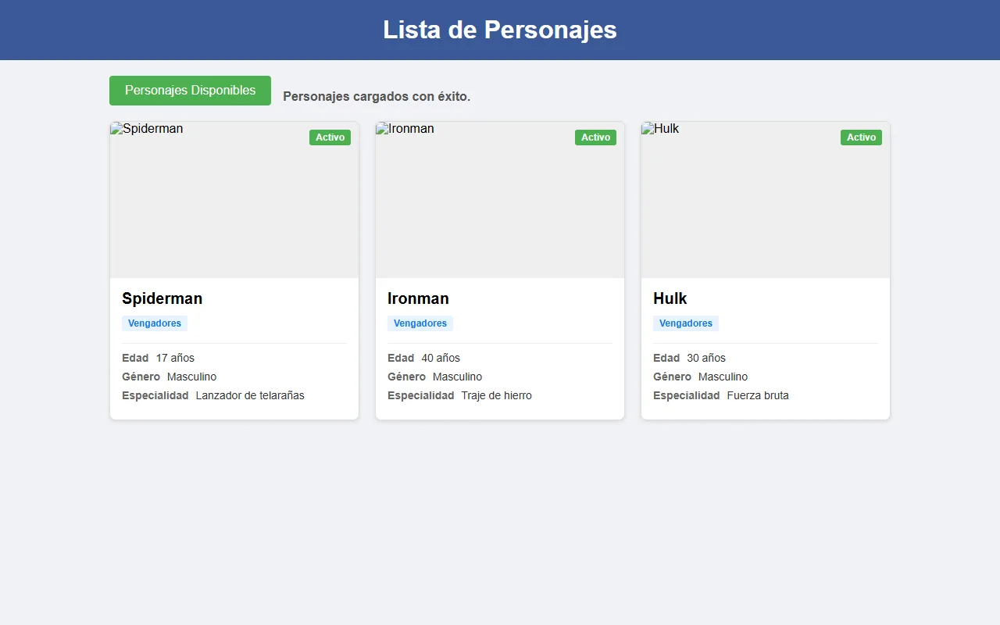
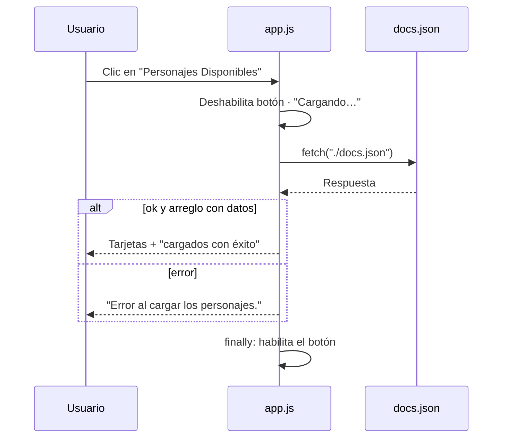

# Lista de personajes — carga asíncrona de JSON

Actividad de **JavaScript** que carga una lista de personajes desde un archivo **JSON** local con `fetch` y `async`/`await`, y genera una tarjeta por personaje con su estado, afiliación, edad, género y especialidad. Muestra el estado de la carga y maneja los errores sin romper la página.




## El problema

Una página que depende de datos externos tiene que esperar a que lleguen, avisar al usuario mientras tanto y reaccionar si la petición falla o los datos vienen mal formados. Esta actividad practica ese ciclo completo con un JSON local como fuente de datos.

## Tecnologías

| Tecnología | Para qué se usa |
| :--- | :--- |
| **JavaScript (ES6+)** | `fetch` con `async`/`await`, `try`/`catch`/`finally`, `createElement` y template literals. |
| **JSON** | `docs.json` con los personajes (nombre, edad, género, afiliación, especialidad, imagen y estado). |
| **HTML5 y CSS3** | Encabezado, botón de carga, mensaje de estado y rejilla de tarjetas. |

## Funciones clave

- **Carga bajo demanda:** el botón *Personajes Disponibles* lanza la petición a `docs.json`.
- **Estado visible:** muestra *Cargando personajes…*, después *cargados con éxito* o el error, y deshabilita el botón mientras carga.
- **Validación de la respuesta:** comprueba `respuesta.ok` y que el JSON sea un arreglo con datos antes de pintar.
- **Tarjetas dinámicas** con insignia de estado (*Activo*), afiliación y detalles del personaje.
- **Recuperación:** el bloque `finally` vuelve a habilitar el botón pase lo que pase.

## Evidencias

La captura de arriba es el resultado real tras pulsar el botón: 3 personajes cargados de `docs.json`.

> Las rutas de `imagen` del JSON apuntan a páginas de Pinterest, no a archivos de imagen, así que el navegador muestra el texto alternativo. Sustituirlas por URL directas a `.jpg`/`.png` mostraría las fotos sin tocar el código.



## Instalación y uso

`fetch` no puede leer archivos locales desde `file://`, así que hace falta un servidor:

```bash
git clone https://github.com/Eidan210/JavaScript-Actividad.git
cd JavaScript-Actividad
python -m http.server 8000
```

Abre `http://localhost:8000/actividad%20javascript/` (o usa **Live Server**) y pulsa **Personajes Disponibles**.

```text
actividad javascript/
├── index.html   # Estructura y contenedor de tarjetas
├── app.js       # Carga asíncrona, validación y render
├── docs.json    # Datos de los personajes
└── styles.css
```

## Aprendizajes

- **Consumir datos de forma asíncrona** con `fetch` y `async`/`await`, y validar la respuesta antes de usarla.
- **Usar `try`/`catch`/`finally` con intención:** el `finally` garantiza que la interfaz se recupere aunque haya error.
- **Comunicar el estado al usuario** con mensajes de carga, éxito y error, y bloqueando el botón para evitar peticiones duplicadas.
- **Generar HTML desde JSON** con `createElement` y template literals.

---

Desarrollado por **Eidan Alexander Carreño** ([@Eidan210](https://github.com/Eidan210)) · Campuslands.
